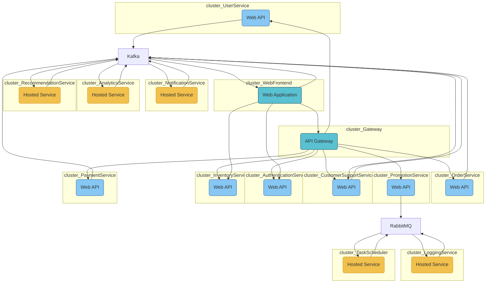

```mermaid
graph TD
  subgraph cluster_UserService
    UserService(Web API)
  end

  subgraph cluster_OrderService
    OrderService(Web API)
  end

  subgraph cluster_NotificationService
    NotificationService(Hosted Service)
  end

  subgraph cluster_AnalyticsService
    AnalyticsService(Hosted Service)
  end

  subgraph cluster_RecommendationService
    RecommendationService(Hosted Service)
  end

  subgraph cluster_LoggingService
    LoggingService(Hosted Service)
  end

  subgraph cluster_PromotionService
    PromotionService(Web API)
  end

  subgraph cluster_CustomerSupportService
    CustomerSupportService(Web API)
  end

  subgraph cluster_Gateway
    Gateway(API Gateway)
  end

  subgraph cluster_WebFrontend
    WebFrontend(Web Application)
  end

  subgraph cluster_AuthenticationService
    AuthenticationService(Web API)
  end

  subgraph cluster_InventoryService
    InventoryService(Web API)
  end

  subgraph cluster_TaskScheduler
    TaskScheduler(Hosted Service)
  end

  subgraph cluster_PaymentService
    PaymentService(Web API)
  end

  Gateway --> UserService
  Gateway --> OrderService
  Gateway --> PromotionService
  Gateway --> CustomerSupportService
  Gateway --> AuthenticationService
  Gateway --> InventoryService
  Gateway --> PaymentService

  UserService --> Kafka
  OrderService --> Kafka
  NotificationService --> Kafka
  AnalyticsService --> Kafka
  RecommendationService --> Kafka
  LoggingService --> RabbitMQ
  PromotionService --> RabbitMQ
  CustomerSupportService --> Kafka
  TaskScheduler --> RabbitMQ
  PaymentService --> Kafka

  Kafka --> WebFrontend
  Kafka --> NotificationService
  Kafka --> AnalyticsService
  Kafka --> RecommendationService
  Kafka --> CustomerSupportService

  RabbitMQ --> LoggingService
  RabbitMQ --> TaskScheduler

  WebFrontend --> Gateway
  WebFrontend --> Kafka
  WebFrontend --> AuthenticationService
  WebFrontend --> InventoryService

  style UserService fill:#86C7F3,stroke:#2E5D9E
  style OrderService fill:#86C7F3,stroke:#2E5D9E
  style NotificationService fill:#F1C04D,stroke:#D19528
  style AnalyticsService fill:#F1C04D,stroke:#D19528
  style RecommendationService fill:#F1C04D,stroke:#D19528
  style LoggingService fill:#F1C04D,stroke:#D19528
  style PromotionService fill:#86C7F3,stroke:#2E5D9E
  style CustomerSupportService fill:#86C7F3,stroke:#2E5D9E
  style Gateway fill:#59C1D1,stroke:#0E3A4D
  style WebFrontend fill:#59C1D1,stroke:#0E3A4D
  style AuthenticationService fill:#86C7F3,stroke:#2E5D9E
  style InventoryService fill:#86C7F3,stroke:#2E5D9E
  style TaskScheduler fill:#F1C04D,stroke:#D19528
  style PaymentService fill:#86C7F3,stroke:#2E5D9E
```